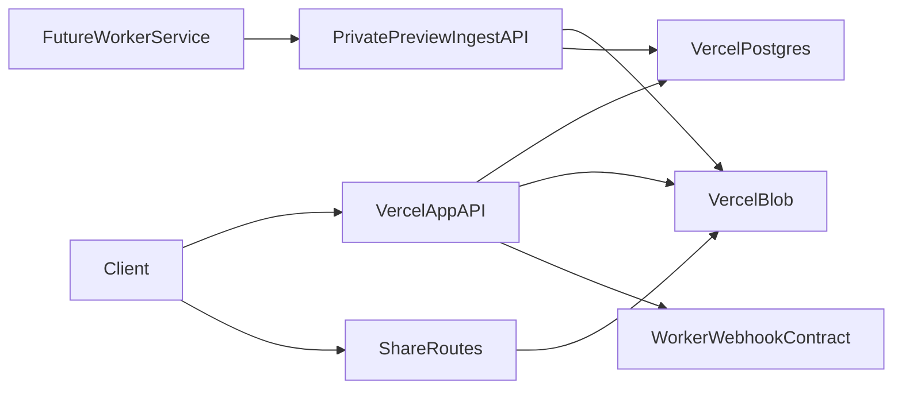

# Latex -> Vercel Migration (Phased Plan)

## Target Architecture (agreed constraints)

- App runtime: Vercel (Next.js app + API routes).
- Primary data/storage: Vercel Postgres + Vercel Blob.
- Worker: do **not** implement worker service yet; implement the async integration contract now:
  - app emits "preview requested" call on upload completion,
  - private endpoint accepts generated preview payload (base64) for an upload/media ID,
  - app updates `previewStatus` lifecycle (`pending|processing|ready|failed`) and polling behavior.

## Current-System Observations To Carry Forward

- Share routing is atypical and must be preserved:
  - file links include extension (`/share/code.ext`) and should return file bytes directly (embed/download-manager compatible),
  - album links are extensionless (`/share/code`) and route to album page.
- Media serving currently uses signed-URL redirects in S3 mode and limited `Range` handling (video/audio originals). This behavior influences CDN strategy and seek support.
- Upload/session pipeline has known integrity flaws (missing-part finalize risk; weak end-to-end checksum semantics).
- Preview generation currently depends on native binaries (`ffmpeg`, `soffice`, `pdftoppm`) in app runtime; this must be removed from request-path responsibilities on Vercel.
- Admin DB tooling includes migration helper and legacy `pg_*` binary usage that must be cleaned up per your requirements.

## Phase 0 - Baseline Inventory + Safety Net (no architecture switch yet)

### Work

- Freeze behavior with a migration branch and feature flags for storage/runtime transitions.
- Inventory and document all AWS-coupled and Docker-coupled modules from active code and `.legacy` references:
  - infra (legacy): [.legacy/infra/cdk](/media/nvme_raid0/Repos/latex-host/.legacy/infra/cdk)
  - scripts (legacy): [.legacy/scripts/infra](/media/nvme_raid0/Repos/latex-host/.legacy/scripts/infra)
  - docker/runtime refs: [Dockerfile](/media/nvme_raid0/Repos/latex-host/Dockerfile), [docker-compose.yml](/media/nvme_raid0/Repos/latex-host/docker-compose.yml), [.legacy/docker/entrypoint.sh](/media/nvme_raid0/Repos/latex-host/.legacy/docker/entrypoint.sh)
  - media/storage: [src/lib/media-storage.ts](/media/nvme_raid0/Repos/latex-host/src/lib/media-storage.ts), [src/lib/storage.ts](/media/nvme_raid0/Repos/latex-host/src/lib/storage.ts)
  - upload session flow: [src/app/api/uploads](/media/nvme_raid0/Repos/latex-host/src/app/api/uploads) and [src/lib/upload-sessions.ts](/media/nvme_raid0/Repos/latex-host/src/lib/upload-sessions.ts)
- Add structured test scaffolding (unit + route-level integration) and CI test runner.

### Validation gate (must be executed before Phase 1)

- Test harness is executed in CI and locally; failures are logged and triaged (non-blocking at this stage).
- Baseline tests exist and are executed for:
  - share route parsing (file vs album),
  - public media serving headers + range handling,
  - upload init/part/complete nominal path,
  - preview status polling contract.

## Phase 1 - Test-First Hardening of Existing Critical Paths

### Work

- Implement tests for existing (not new-only) behavior and current regressions:
  - upload integrity edge cases (missing part, duplicate part, finalize race),
  - share anonymity regressions (no owner metadata leakage in responses/pages),
  - range request correctness for media seeking,
  - preview status transitions and failed-state UI handling.
- Introduce contract tests around current API routes to enable safe refactoring.
- Execute tests and capture known-failure list tied to required fixes.

### Validation gate

- Test suite includes cases that reproduce known flaws, with clear tracking of expected failures where migration work is in progress.
- Coverage includes public share endpoints and upload-session APIs, even if some tests are temporarily non-blocking.

## Phase 2 - Vercel Platform Bootstrap (App + Data)

### Work

- Add Vercel deployment config/environment mapping and secrets contract cleanup.
- Migrate DB connectivity to Vercel Postgres-compatible config path; remove ECS/Secrets Manager runtime assumptions from app code.
- Add Blob storage abstraction and switch default storage backend to Vercel Blob.
- Keep share URL shapes unchanged and preserve direct file response semantics for shared file links.

### Key files likely touched

- [src/db/index.ts](/media/nvme_raid0/Repos/latex-host/src/db/index.ts)
- [src/lib/media-storage.ts](/media/nvme_raid0/Repos/latex-host/src/lib/media-storage.ts)
- [src/app/share/[fileName]/route.ts](/media/nvme_raid0/Repos/latex-host/src/app/share/[fileName]/route.ts)
- [src/app/share/album/[shareId]/media/[kind]/[mediaId]/[fileName]/route.ts](/media/nvme_raid0/Repos/latex-host/src/app/share/album/[shareId]/media/[kind]/[mediaId]/[fileName]/route.ts)

### Validation gate

- Staging on Vercel passes smoke tests:
  - upload/download/view for image/video/document/archive,
  - public share file link returns file content (not HTML page),
  - album share link resolves correctly,
  - media seek works (`Range` verified).

## Phase 3 - Async Preview Contract (without implementing worker service)

### Work

- Refactor upload completion flow to enqueue/emit preview request contract rather than running heavy generation inline.
- Add private ingest endpoint for worker result submission:
  - authenticated via shared secret/signature,
  - accepts upload/media ID + base64 preview payload + metadata,
  - persists preview asset to Blob and updates DB status.
- Expand preview state model and retry/error semantics for robust polling:
  - `pending -> processing -> ready|failed`.
- Remove synchronous document preview generation from request path; align docs with video-style async lifecycle.

### Key files likely touched

- [src/app/api/media/route.ts](/media/nvme_raid0/Repos/latex-host/src/app/api/media/route.ts)
- [src/app/api/media/from-upload-session/route.ts](/media/nvme_raid0/Repos/latex-host/src/app/api/media/from-upload-session/route.ts)
- [src/app/api/media/preview-status/route.ts](/media/nvme_raid0/Repos/latex-host/src/app/api/media/preview-status/route.ts)
- [src/components/upload-dropzone.tsx](/media/nvme_raid0/Repos/latex-host/src/components/upload-dropzone.tsx)
- [src/components/gallery-client.tsx](/media/nvme_raid0/Repos/latex-host/src/components/gallery-client.tsx)

### Validation gate

- Automated tests for ingest endpoint auth, payload validation, state transitions, and blob persistence are implemented and executed; temporary failures are tracked if tied to in-flight migration changes.
- UI polling stops on `failed`, surfaces error state, and supports retry trigger.

## Phase 4 - Upload Security and Robustness Refactor

### Work

- Harden resumable uploads:
  - require expected parts manifest,
  - verify full part set before finalize,
  - enforce size ceilings and chunk constraints consistently,
  - add end-to-end checksum verification at finalize.
- Add distributed rate limiting (Vercel-compatible backend) to upload init/part/complete and share hot paths.
- Add targeted abuse controls for high-traffic shared objects (token bucket + per-resource caps + anomaly logging).

### Validation gate

- Security tests are implemented and executed for tampered chunk, missing part, replay, oversize, and checksum mismatch.
- Load tests show limiter enforcement without breaking normal uploads/streaming.

## Phase 5 - CDN/Caching Semantics on Vercel

### Work

- Define cache-control strategy per resource class:
  - revocable share resources,
  - immutable media derivatives,
  - private/authenticated media.
- Ensure revocation invalidates access quickly (short TTL + token/version strategy, not stale long-lived URLs).
- Validate embed/download manager compatibility and preserve direct byte serving behavior.

### Validation gate

- Cache behavior tests are executed to verify fresh denial after revoke.
- Browser and download-client checks confirm range + resume + embeds still work.

## Phase 6 - Admin & Infrastructure Cleanup

### Work

- Remove AWS-specific/admin features you requested to retire:
  - AWS billing page/backend,
  - DB migration helper route/backend,
  - pg_* binary dependent code paths.
- Keep and refactor DB export/import features to pure SQL-in-app implementation (no system binaries).
- Remove obsolete ECS/CDK/docker deployment artifacts once Vercel pipeline is stable.

### Candidate cleanup targets

- [.legacy/infra/cdk](/media/nvme_raid0/Repos/latex-host/.legacy/infra/cdk)
- [.legacy/scripts/infra](/media/nvme_raid0/Repos/latex-host/.legacy/scripts/infra)
- [src/app/api/admin/settings/db-push/route.ts](/media/nvme_raid0/Repos/latex-host/src/app/api/admin/settings/db-push/route.ts)
- [src/lib/billing-cost-explorer.ts](/media/nvme_raid0/Repos/latex-host/src/lib/billing-cost-explorer.ts)
- [src/app/api/admin/settings/db-import/route.ts](/media/nvme_raid0/Repos/latex-host/src/app/api/admin/settings/db-import/route.ts) (refactor/remove binary branches)

### Validation gate

- No dead references to retired AWS paths.
- Admin DB export/import test cases are implemented and executed end-to-end without pg_* binaries.

## Phase 7 - Worker-Readiness Expansion Plan (design now, implement later)

### Work

- Produce implementation-ready design doc for external worker service:
  - queue protocol + idempotency keys,
  - retry/dead-letter behavior,
  - capability matrix for document/video/audio/360 previews,
  - black-frame-aware video thumbnail selection strategy,
  - storage/key conventions and cost controls.
- Include optional future integration points for adaptive streaming (HLS/DASH) without implementing transcoding now.

### Validation gate

- Signed-off worker API/queue contract and test fixtures exist in repo.
- A fake worker test harness can post preview results into private ingest endpoint.

## Test Strategy (applies across all phases)

- Add test pyramid immediately:
  - unit tests for parsers/validators/range/checksum utilities,
  - route integration tests for API handlers,
  - minimal e2e smoke for upload/share/playback/revocation.
- Execute tests in each phase before advancing; during early migration phases, test failures are non-blocking if documented and attributable to planned in-flight refactors.
- Reintroduce strict green gating after the core Vercel migration cutover (end of Phase 4) and before cleanup completion.
- Add regression tests whenever a bug/security flaw is fixed.

## Risks and Non-Obvious Constraints

- Vercel functions are not appropriate for heavy native media conversion; keep that out of request path.
- Preserve your atypical but important URL contract (`/share/code.ext` as direct bytes, `/share/code` as album route).
- Ensure anonymity guarantees include page-level metadata rendering (e.g., avoid leaking original filenames where inappropriate).
- Range handling must be validated against Blob/object-store behavior, especially under CDN caching.
- Revocation behavior must be designed with caching strategy from the start to avoid stale public access.

## Deliverables By End Of Plan

- Fully Vercel-hosted app runtime + data path (Vercel Postgres/Blob).
- Async preview contract implemented and tested (worker-ready).
- Legacy AWS/docker-specific operational code removed or archived.
- Executed, automated test suite covering existing and new critical paths.
- Worker implementation spec ready for next milestone.
